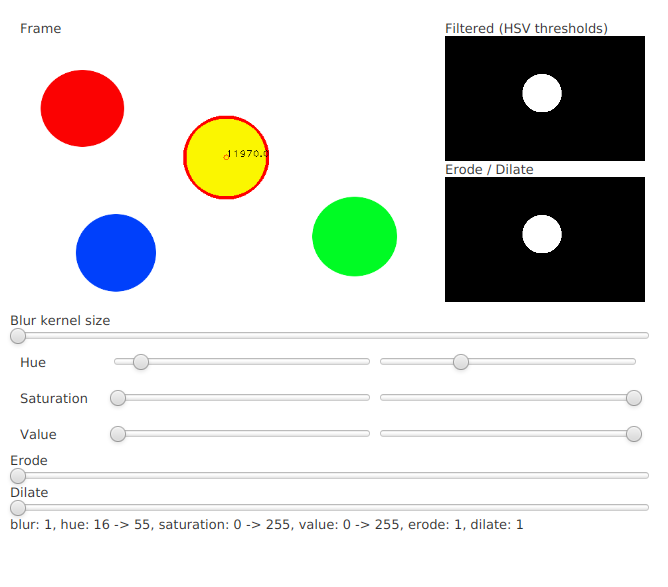

Beispielcode von unserem Tech-Event 'Objekterkennung mit OpenCV' vom 05.2018

  - die library unter `lib/` wurde unter NixOS gebaut - wird unter anderen Systemen nicht funktionieren
  - um die OpenCV Java bindgings selber zu bauen, siehe: https://opencv-java-tutorials.readthedocs.io/en/latest/
